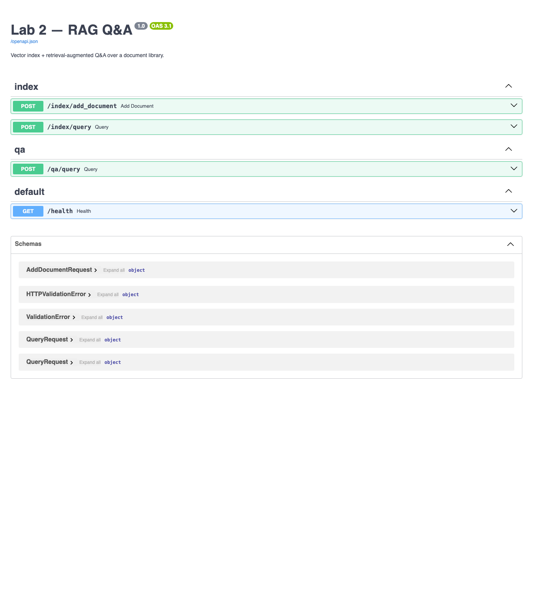

# Lab 2 — Report

**Author:** Mykhailo Kreslavskyi
**Date:** 2026-06-02

Retrieval-Augmented Generation (RAG) over a small document library: a vector index with an HTTP management API (Task 1), and a Q&A assistant that answers questions from the retrieved chunks using Claude (Task 2). Both APIs are served by a single FastAPI app (`app/main.py`) and grouped under `/index` and `/qa` routers.

## 1. Task 1 — Index creation

### 1.1 Vector store & embeddings

| Choice | What | Why |
|---|---|---|
| Vector store | **Chroma**, embedded (`PersistentClient(path="chroma_db")`) | Persists to disk, no separate DB server to run or configure — the simplest store that satisfies "any vector DBMS". |
| Embeddings | **`all-MiniLM-L6-v2`** (`sentence-transformers`), 384-dim | Runs locally and free — no API key, no per-call cost. Chosen because Anthropic provides no embeddings API, so embeddings must come from elsewhere regardless. |
| Collection | single `documents` collection; we pass our own embeddings | Keeps `/index/add_document` and `/index/query` symmetric and explicit — Chroma never re-embeds behind our back. |

The embedding model loads once at process start (`app/rag.py`) and downloads (~80 MB) on first run.

### 1.2 Chunking

Documents are split by `chunk(text, size=800, overlap=100)` in `app/rag.py`: ~800-character chunks with a 100-character overlap, preferring to break on a paragraph (`\n\n`) or sentence (`. `) boundary near the end of each window so sentences aren't cut in half. The overlap keeps context that straddles a boundary retrievable from both chunks. This is a ~20-line dependency-free function — no LangChain — keeping the pipeline easy to read.

### 1.3 Index API

| Method | Path | Body | Returns |
|---|---|---|---|
| POST | `/index/add_document` | `{"text": "...", "source": "name"}` | `{"source", "chunks_added"}` |
| POST | `/index/query` | `{"vector": [floats], "k": 5}` | `{"results": [{text, source, distance}]}` |

`/add_document` chunks → embeds → stores each chunk with its `source` as metadata. `/query` accepts a **query vector** (per the task spec) and returns the top-K nearest chunks by L2 distance (lower = more similar).

Example — embedding the question *"What accuracy did the model reach?"* to a 384-dim vector and POSTing it to `/index/query` with `k=3`:

```text
[report.md]                       dist=1.255  '... | Head | 100 | AvgPool → Linear | ... Trainable parameters: **~11.2 M**.'
[report.md]                       dist=1.262  '... Val top-5 accuracy at that epoch: **93.57 %** ... Total training time: **42.7'
[train_resnet_cifar100.ipynb]     dist=1.377  '... logits = model(x); loss = criterion(logits, y); loss.backward() ...'
```

The two closest chunks are exactly the report sections about model size and accuracy — retrieval is surfacing the relevant material.

### 1.4 Populating the store

The corpus is reused from **Lab 1** (`../ml-tech-1-lab`). `ingest.py` reads three documents, posting each to the live `/index/add_document` endpoint (notebooks are parsed as plain JSON, joining markdown + code cell sources). Output:

```text
report.md: 12 chunks
README.md: 3 chunks
train_resnet_cifar100.ipynb: 19 chunks
```

**34 chunks total** are stored in the vector index.

## 2. Task 2 — Q&A assistant

### 2.1 LLM choice and prompt template

The assistant calls **Claude** via the official `anthropic` Python SDK (`app/llm.py`). The model is configurable via the `LLM_MODEL` env var; this run used `claude-haiku-4-5` (cheapest/fastest), with `claude-sonnet-4-6` as the default.

The prompt template has the three required parts. The **task definition** is the system prompt:

```text
You are a question-answering assistant. Answer the user's question using
ONLY the provided context. If the answer is not contained in the context,
say you don't know — do not make anything up. Keep answers concise.
```

The **context chunks** and the **user query** are sent as two blocks of the user message, so the answer is grounded strictly in retrieved text:

```text
Context:
{joined retrieved chunks}

Question: {user question}
```

The context block is marked with `cache_control: {"type": "ephemeral"}` so Claude can reuse it across repeated queries with the same retrieved context.

### 2.2 Q&A API

| Method | Path | Body | Returns |
|---|---|---|---|
| POST | `/qa/query` | `{"question": "...", "k": 5}` | `{"answer", "sources": [...]}` |

The flow (`app/qa_api.py`): embed the question with the same local model → retrieve the top-K chunks via the Task 1 retrieval function → fill the prompt template → call Claude → return the answer plus the distinct `sources` that informed it.

### 2.3 Example Q&A

**Grounded question** — `POST /qa/query`:

```json
{
  "question": "What model architecture was trained in Lab 1 and on what dataset, and what top-1 accuracy did it reach?",
  "k": 5
}
```

Response:

```json
{
  "answer": "Based on the context provided:\n\n**Model Architecture:** ResNet-18 (implemented from scratch in PyTorch), specifically a CIFAR-style ResNet-18 with ~11.2 M trainable parameters.\n\n**Dataset:** CIFAR-100\n\n**Top-1 Accuracy:** 76.33% (achieved at epoch 58)",
  "sources": ["README.md", "report.md", "train_resnet_cifar100.ipynb"]
}
```

Every fact (ResNet-18 from scratch, CIFAR-100, ~11.2 M params, 76.33% at epoch 58) matches the Lab 1 report — the answer is drawn from the retrieved chunks, not invented.

**Off-topic question** — proving the grounding holds:

```json
{ "question": "What is the capital of France?", "k": 5 }
```

Response:

```json
{
  "answer": "I don't know — that question is not contained in the provided context. The context is about training a ResNet-18 model on CIFAR-100, not about geography.",
  "sources": ["report.md", "train_resnet_cifar100.ipynb"]
}
```

The assistant declines rather than answering from the model's general knowledge — exactly the behavior the system prompt enforces.

### 2.4 API surface

All four endpoints, grouped by router, in the auto-generated Swagger UI (`/docs`):



## 3. Reproducing this work

```bash
# 1. Install (Python 3.11+ recommended)
python3 -m venv .venv && source .venv/bin/activate
pip install -r requirements.txt

# 2. Configure the Claude key
cp .env.example .env          # then set ANTHROPIC_API_KEY=...

# 3. Run the API
uvicorn app.main:app --reload  # docs at http://localhost:8000/docs

# 4. Populate the index (in another terminal)
python ingest.py

# 5. Ask a question
curl -X POST http://localhost:8000/qa/query \
  -H 'Content-Type: application/json' \
  -d '{"question":"What model architecture was trained in Lab 1 and on what dataset?","k":5}'
```
